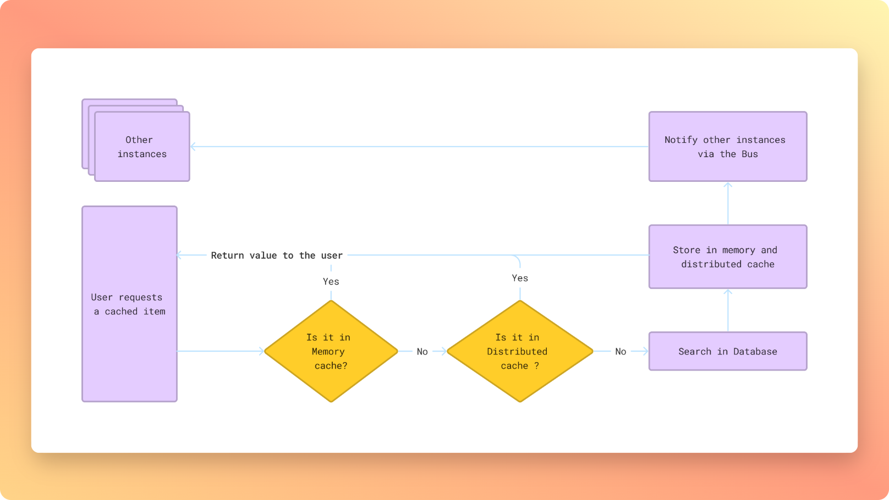
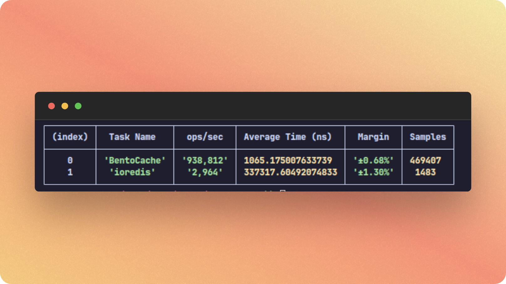

<p align="center">
  <br/>
  <a href="https://bentocache.dev/">Bentocache</a> is a robust multi-tier caching solution for Node.js applications
  <br/>
</p>

## Features

- 🗄️ Multi-tier caching
- 🔄 Synchronization of local cache via Bus
- 🚀 Many drivers (Redis, Upstash, In-memory, Postgres, Sqlite and others)
- 🛡️ Grace period and timeouts. Serve stale data when the store is dead or slow
- 🤓 SWR-like caching strategy
- 🗂️ Namespaces. Group your keys by categories.
- 🛑 Cache stamped protection.
- 🏷️ Named caches
- 📖 Well documented + handy JSDoc annotations
- 📊 Events. Useful for monitoring and metrics
- 📝 Easy Prometheus integration and ready-to-use Grafana dashboard
- 🧩 Easily extendable with your own driver

See documentation at [bentocache.dev](https://bentocache.dev/docs/introduction)

## Why Bentocache ? 

There are already caching libraries for Node: [`keyv`](https://keyv.org/), [`cache-manager`](https://github.com/node-cache-manager/node-cache-manager#readme), or [`unstorage`](https://unstorage.unjs.io/). However, I think that we could rather consider these libraries as bridges that allow different stores to be used via a unified API, rather than true caching solutions as such.

Not to knock them, on the contrary, they have their use cases and cool. Some are even "marketed" as such and are still very handy for simple caching system.

Bentocache, on the other hand, is a **full-featured caching solution**. We indeed have this notion of unified access to differents drivers, but in addition to that, we have a ton of features that will allow you to do robust caching.

## Quick presentation

Bentocache is a caching solution aimed at combining performance and flexibility. If you are looking for a caching system that can transition from basic use to advanced multi-level configuration, you are in the right place. Here's what you need to know :

### One-level

The one-level mode is a standard caching method. Choose from a variety of drivers such as **Redis**, **In-Memory**, **Filesystem**, **DynamoDB**, and more, and you're ready to go. 

In addition to this, you benefit from many features that allow you to efficiently manage your cache, such as **cache stampede protection**, **grace periods**, **timeouts**, **namespaces**, etc.

### Two-levels
For those looking to go further, you can use the two-levels caching system. Here's basically how it works:

- **L1: Local Cache**: First level cache. Data is stored in memory with an LRU algorithm for quick access
- **L2: Distributed Cache**: If the data is not in the in-memory cache, it is searched in the distributed cache (Redis, for example)
- **Synchronization via Bus**: In a multi-instance context, you can synchronize different local in-memory caches of your instances via a Bus like Redis or RabbitMQ. This method maintains cache integrity across multiple instances

Here is a simplified diagram of the flow :



All of this is managed invisibly for you via Bentocache. The only thing to do is to set up a bus in your infrastructure. But if you need multi-level cache, you're probably already using Redis rather than your database as a distributed cache. So you can leverage it to synchronize your local caches

The major benefit of multi-tier caching, is that it allows for responses between 2,000x and 5,000x faster. While Redis is fast, accessing RAM is REALLY MUCH faster.

In fact, it's a quite common pattern : to quote an example, it's [what Stackoverflow does](https://nickcraver.com/blog/2019/08/06/stack-overflow-how-we-do-app-caching/#layers-of-cache-at-stack-overflow). 


To give some perspective, here's a simple benchmark that shows the difference between a simple distributed cache ( using Redis ) vs a multi-tier cache ( using Redis + In-memory cache ) :

 

## Features

Below is a list of the main features of BentoCache. If you want to know more, you can read each associated documentation page.

### Multi layer caching

Multi-layer caching allows you to combine the speed of in-memory caching with the persistence of a distributed cache. Best of both worlds.

### Lot of drivers

Many drivers available to suit all situations: Redis, Upstash, Database (MySQL, SQLite, PostgreSQL), DynamoDB, Filesystem, In-memory (LRU Cache), Vercel KV...

See the [drivers documentation](https://bentocache.dev/docs/cache-drivers) for list of available drivers. Also very easy to extend the library and [add your own driver](https://bentocache.dev/docs/custom-cache-driver)

### Resiliency

- [Grace period](https://bentocache.dev/docs/grace-periods): Keep your application running smoothly with the ability to temporarily use expired cache entries when your database is down, or when a factory is failing.

- [Cache stamped prevention](https://bentocache.dev/docs/stampede-protection): Ensuring that only one factory is executed at the same time.

- [Retry queue](https://bentocache.dev/docs/multi-tier#retry-queue-strategy) : When a application fails to publish something to the bus, it is added to a queue and retried later.

### Timeouts 

If your factory is taking too long to execute, you can just return a little bit of stale data while keeping the factory running in the background. Next time the entry is requested, it will be already computed and served immediately.

### Namespaces

The ability to create logical groups for cache keys together, so you can invalidate everything at once later :

```ts
const users = bento.namespace('users')

users.set('32', { name: 'foo' })
users.set('33', { name: 'bar' })

users.clear() 
```

### Events

Events are emitted by Bentocache throughout its execution, allowing you to collect metrics and monitor your cache.

```ts
bento.on('cache:hit', () => {})
bento.on('cache:miss', () => {})
// ...
```

See the [events documentation](https://bentocache.dev/docs/events) for more information.

### Friendly TTLs

All TTLs can be passed in a human-readable string format. We use [lukeed/ms](https://github.com/lukeed/ms) under the hood. (this is optional, and you can pass a `number` in milliseconds if you prefer)

```ts
bento.getOrSet({
  key: 'foo',
  ttl: '2.5h',
  factory: () => getFromDb(),
})
```

### Logging

You can pass a logger to Bentocache, and it will log everything that happens. Can be useful for debugging or monitoring.

```ts
import { pino } from 'pino'

const bento = new BentoCache({
  logger: pino()
})
```

See the [logging documentation](https://bentocache.dev/docs/logging) for more information.

## Sponsors

If you like this project, [please consider supporting it by sponsoring it](https://github.com/sponsors/Julien-R44/). It will help a lot to maintain and improve it. Thanks a lot !


